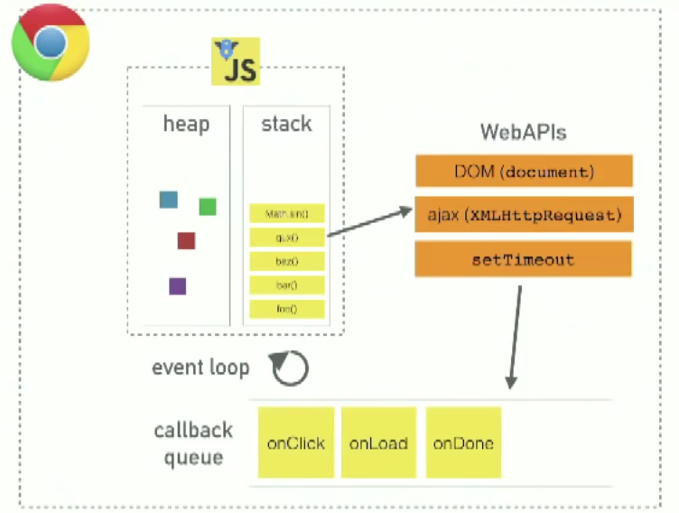

# **NodeJS**

## **Conocimientos Previos**

### **Capas**

Es una de la tecnicas mas comunes que los diseñadores de software usan para romper en partes un sistema complejo.

En este esquema, la capa superior usa varios servicios definidos por la capa inferior, que no es consciente de la capa superior.Ademas cada capa generalmente oculta sus capas inferiores.

La parte mas dura de la arquitectura por capas es decidir que capas tener y que responsabilidad deberian tener cada una.

## **¿Qué es nodejs?**

Es javascript que se ejecuta en el servidor, usa el motor V8 de Google

## **¿Por qué es tan popular?**

- Entradas simultaneas que no realizan bloqueos al servidor(peticiones asincronas)
- Es sumamente rápido y fácil de configurar
- Más de 470 mil paquetes disponibles(el ecosistema con más librerías en el mundo)

## **¿Qué puedo hacer con Node?**

- Uso de socket para una comucación real Cliente-Servidor
- Manejo de archivos en FileSystem , cargas simultáneas
- Servidores locales y remotos con información en tiempo real
- Conexiones a bases de datos
- Creacion de servicios REST en segundos

## **¿Quienes lo usan?**

- Netflix
- Paypal
- Linkedin
- Walmart
- Uber
- Nasa

> Nodejs usa una conducción por eventos que no se bloquean en las entradas y salidas al conectarse con el servidor.

## **Ciclo de vida de un proceso**

1.- Pila de procesos (Request & Response)

2.- Pila de subprocesos (Async & Request)

3.- Cola de Callbacks (Async & Response)


## **Blocking vs Non-Blocking I/O**

[Fuentes](https://github.com/jonmircha/edfullstackjs-2018/tree/master/Node)

**Modelo sincronico(Blocking) :**

```javascript
    let {getUsuarios} = require('./usuarios/usuario')

    console.log('Inicio de programa')

    let usuario1 = getUsuariosSync(1)
    console.log('Usuario1 : ',usuario1)

    let usuario2 = getUsuariosSync(2)
    console.log('Usuario2 : ',usuario2)

    console.log('Hola mundo !!')
```

***Output***

```sh
    $ node sincronico
    > Inicio de programa
    > Usuario1 : {id: 1, nombre: 'Usuario1'}
    > Usuario2 : {id: 2, nombre: 'Usuario2'}
    > Hola mundo !!
```

**Modelo asincronico(Non-blocking) :**

```javascript
    let {getUsuarios} = require('./usuarios/usuario')

    console.log('Inicio de programa')

    getUsuarios(1,(usuario1)=>{
        console.log(usuario1)
    })

    getUsuarios(2,(usuario2)=>{
        console.log(usuario2)
    })

    console.log('Hola mundo !!')
```

***Output***

```sh
    $ node asincronico
    > Inicio de programa
    > Hola mundo !!
    > Usuario1 : {id: 1, nombre: 'Usuario1'}
    > Usuario2 : {id: 2, nombre: 'Usuario2'}
```

## **Procesos dentro de NodeJS**

- Call stack
- Node Api's
- Cola de callbacks


